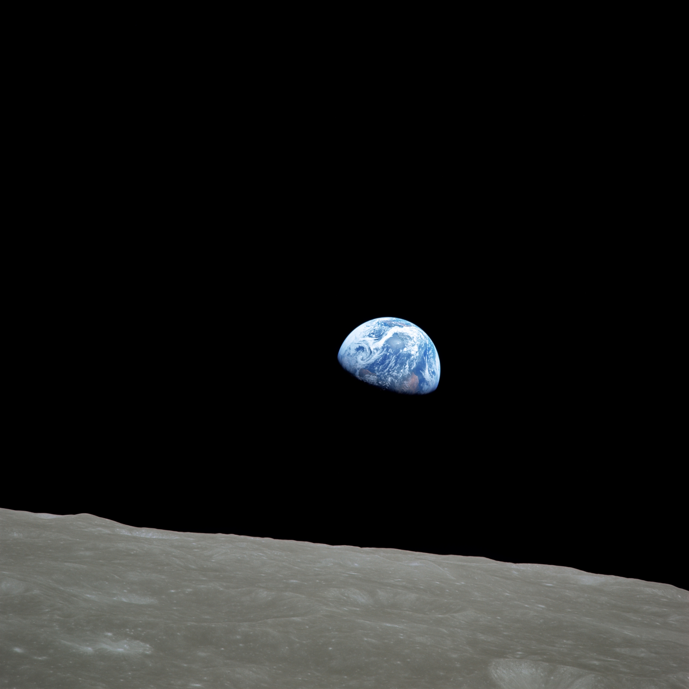
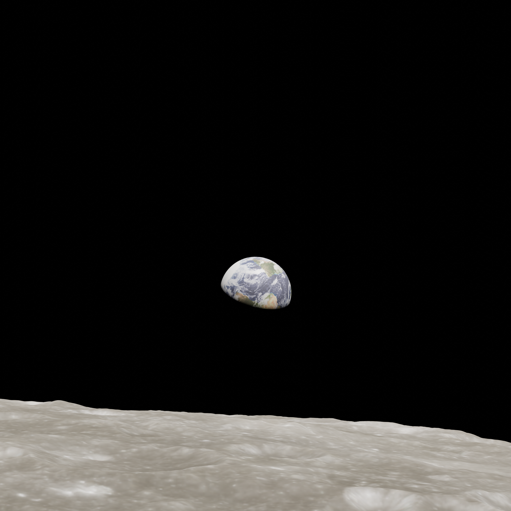
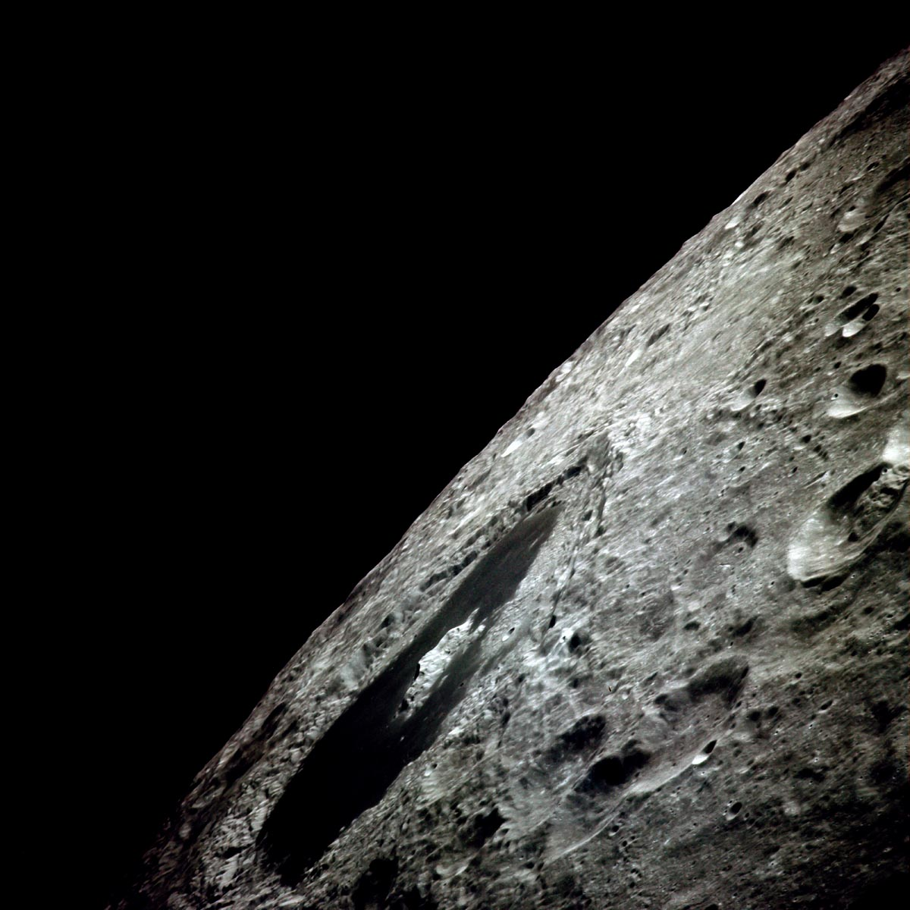
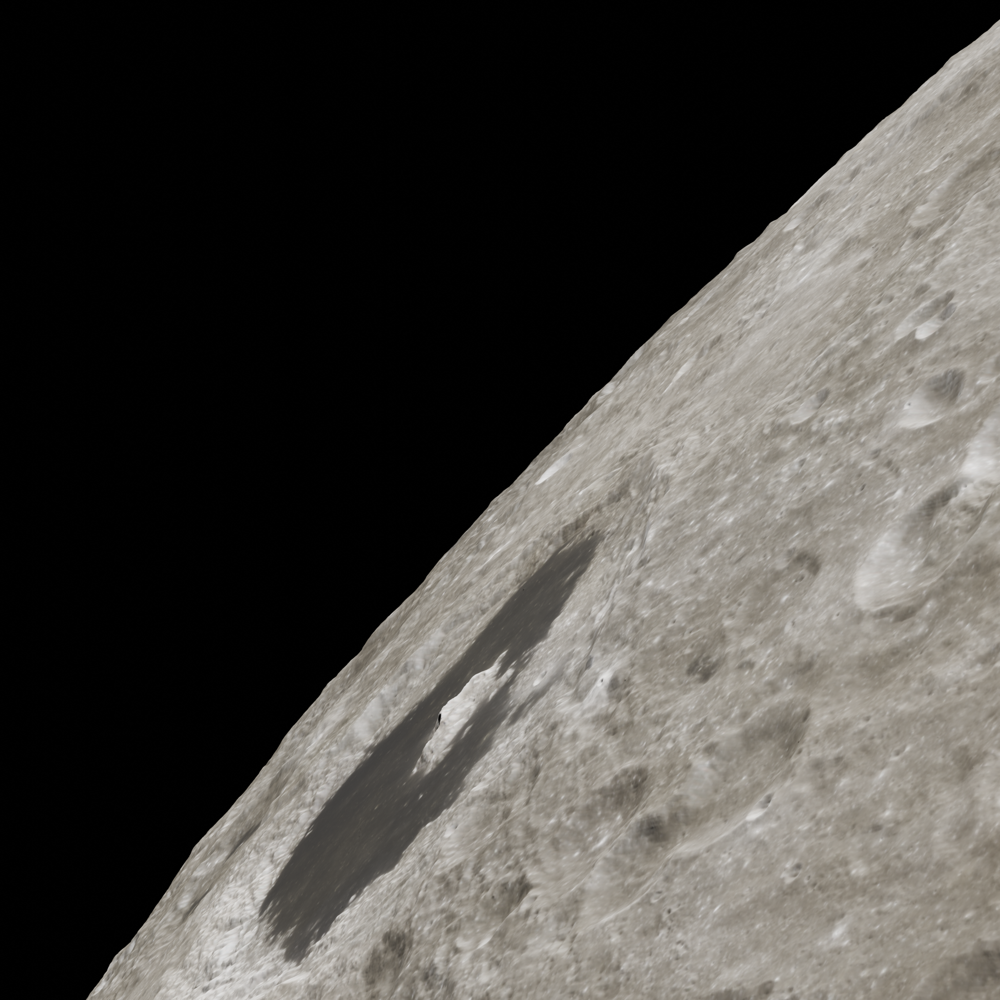

# BOROMIR

## Description

The Blender-based Open-source Repository for Opnav Moon Image Rendering (BOROMIR) is a utility for generating simulated images of the Moon from lunar orbit.

## Abstract

BOROMIR utilizes digital elevation maps (DEMs) and albedo maps of the Moon to generate meshes and create simulated images from a camera state and time (Sun, Earth position). For each image/set, BOROMIR determines what portion of the Moon is visible to the camera, and creates a mesh for that section, which is then rendered via Blender. Crucially, a metadata file is also created, specifying all of the known state data and other info required to recreate the image. This can be useful when it is necessary to have access to both an image of the Moon as well as the camera state when it was taken.

## Gallery

### Standalone Renders

Here is a small collection of images generated by BOROMIR to give you some sense of what it is capable of.


### Comparisons

Here are my attempts at recreating actual images, by making educated guesses at camera states and combing the old Apollo logs for image capture times.

| Apollo Image | BOROMIR Generated Image |
| ---------- | ----------------------- |
|  |  |
|  |  |

## Installation

Installation/Setup information is outlined in [SETUP](docs/SETUP.md). Unfortunately it can still be a bit involved at the moment, too long to cover here.

## Usage

BOROMIR is run from the commandline. The main bash file can be found in the bin/ directory and added to your $PATH. Running as below will show the help page.

``` bash
boromir -h
```

At present, BOROMIR has one option for generating states/images, TRAJECTORY. TRAJECTORY takes a CSV file as argument for specifying the exact states which will be used. In a future update, I will add code to allow random pose generation as well, meeting specified parameters. Essentially, if you just need images under certain conditions (like for generating datasets), RANDOM is the way to go. Alternatively if you have done the work to compute the state for a certain image, then use TRAJECTORY.

### Hello World

Check out [HELLO WORLD](docs/HELLO_WORLD.md) for a walk through of an example run.

## Licensing

This project is covered by the Unlicense, releasing it into the public domain. Information can be found in `UNLICENSE`.

Borrowing from the (claimed) words of Freddie Mercury, "do whatever you want with \[it\], ... just don't make \[it\] boring."

## Authors and Acknowledgements

This project was authored by [Max Marshall](www.github.com/the-astronot) towards the fulfillment of a Masters of Engineering (M. Eng) degree at Rensselaer Polytechnic Institute (RPI) during the year of 2024.

Special thanks to:

- My advisor: Kurt Anderson, PhD for **everything**
- My friend: Sophia Catalan for her help with brainstorming and testing
- My adopted mentor: James McCabe, PhD for believing in this project
- NASA Goddard Spaceflight Center and the LROC: for your maps that make this all possible
- NASA Johnson Space Center: for inspiring this project
- My parents: for supporting me through all this
